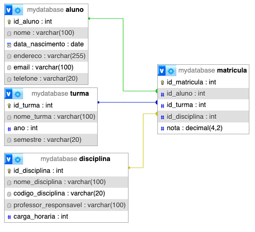

# MySQL/MariaDB

## Utilizanção

A utilização do banco de dados MySQL utilizando estes arquivos é através da criação de contâiner Docker com as seguintes características:

- [Container MySQL](docker-compose.yml): Acessível na porta 3306
- [Container phpMyAdmin](docker-compose.yml): Acessível na porta [8080](http://localhost:8080/)

### Diretório contendo mapeamento dos volumes

Por padrão, o container está configurado para salvar no diretório */var/docker-storage/mysql*, portanto antes de qualquer execução é necessário criar o diretório mapeado.

```bash
mkdir -p /var/docker-storage/mysql
```

### Inicializar o Contâiner

Executar o script [start_docker.sh](start_docker.sh) no diretório mysql, que executará em background.

```bash
./start_docker.sh
```

ou através do docker-compose (retirar o parâmetro "-d" caso não queira executar em background, precisando pressionar CTRL+C para pausar a execução).

```bash
cd mysql
docker-compose up -d
```

### Finalizar o Contâiner

Executar o script [stop_docker.sh](stop_docker.sh) no diretório mysql, caso tenha sido executado em background.

```bash
./stop_docker.sh
```

ou através do docker-compose, caso tenha sido executado em background

```bash
cd mysql
docker-compose stop
```

## Scripts SQL

- [Criação de tabelas](create_tables.sql)
- [População dos dados](inserts.sql)
- [Consultas sobre Aluno](consulta_aluno.sql)
- [Relatório das matrículas](consulta_matricula.sql)
- [Exemplo de agrupamento (Turma)](turmas_groupby.sql)
- [Limpar os dados de todas tabelas (DELETE)](clear_tables.sql)

### Estrutura

Estrutura das tabelas criadas nos scripts

|  |
|-|
| *Diagrama gerado pelo phpMyAdmin* |

## Ocorrências

### MySQL: Connection refused

#### Situação

Ao tentar conectar no MySQL através do phpMyAdmin é apresenato o erro:

```bash
mysqli::real_connect(): (HY000/2002): Connection refused
```

#### Solução

Aguardar a inicialização do banco de dados MySQL

#### Causa

Isso ocorre pelo fato da inicialização do banco de dados MySQL demorar ao realizar a preparação dos seus dados, principalmente na primeira vez em que ele é executado.

Fonte: "*No connections until MySQL init completes*" em [MySQL Docker Hub - Quick reference](https://hub.docker.com/_/mysql).
